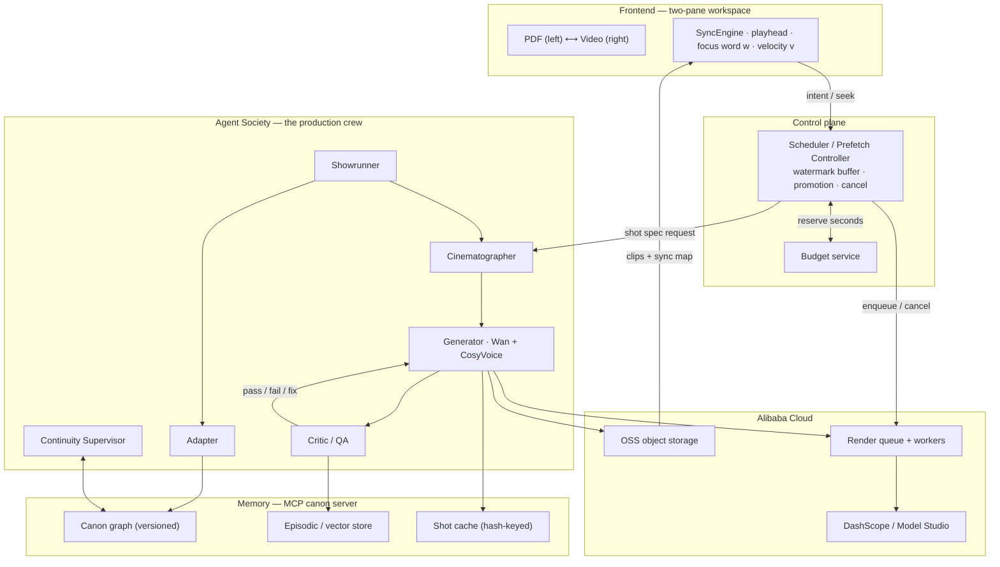

# KINORA — *watch the book*

> Turn any book or PDF into a **watchable, page-synced film that generates itself a few seconds ahead of wherever you're reading** — produced by a crew of AI agents whose shared memory keeps a feature-length adaptation visually consistent instead of melting into AI slop.

The book stays on screen. As the film plays, a narrator reads the text aloud, the exact words being spoken highlight in sync (karaoke-style), and the page turns itself to follow the playhead. You can watch, read along, or both.

|  |  |
|---|---|
| **Hackathon** | Global AI Hackathon Series with Qwen Cloud |
| **Primary track** | Track 2 — AI Showrunner (also covers Track 1 · MemoryAgent and Track 3 · Agent Society) |
| **Deadline** | Jul 9, 2026 · 2:00pm PDT |
| **Deployment** | Alibaba Cloud — ECS / Function Compute · OSS · DashScope / Model Studio |
| **Status** | Design complete · implementation in progress (see [roadmap](#roadmap)) |

---

## The two ideas that make it defensible

Most Track-2 projects do the solved party trick: *type a prompt → get a 15-second short.* The unsolved problem is **long-form consistency** — across the dozens of clips a long story needs, faces change, palettes drift, and props teleport. Kinora's bet is that this is fixable with architecture, not a bigger model:

- **Consistency is a memory problem, not a model problem.** A persistent, versioned **story canon** — what each character looks like, sounds like, where they are, and what has already happened — conditions every generated clip on the *relevant slice* of that truth. Continuity stops being a dice roll and becomes an emergent property of retrieval.
- **The film is a function of attention.** A 300-page book is ~25 minutes of video and would be insane to pre-render — most of it would never be watched. So Kinora never renders a film. It renders the **next few seconds**, just ahead of your eyes, spending its scarce video budget only on pages a human is actually arriving at, and **caching every accepted shot** so a re-read costs nothing.

These two reframes are what let a single architecture win Track 2 (the showrunner), satisfy Track 1 (the memory), and require Track 3 (the crew that maintains it).

## Why anyone cares

Kinora uses the medium that's *destroying* attention spans — short, autoplaying, scrolling video — to deliver the one thing those attention spans can no longer hold: **books.** It's reading-*adjacent*, not reading-replacing — the words stay front and center, the video pulls you through them. That makes it genuinely useful for:

- **Reluctant readers / ADHD** — the video pulls you forward; synced text keeps you reading words, not just absorbing a cartoon.
- **Dyslexia** — simultaneous audio + highlighted text is an evidence-based decoding aid.
- **Language learners** — watch the scene, hear the line, see the word, at reading pace.
- **Manga / webtoon / indie authors** — instant animated adaptations of static panels.

## How it works

### Generation-on-scroll

A reader *dwells*: a page of ~250 words takes 45–90 seconds to read but maps to only ~8–15 seconds of video. That asymmetry is the whole trick — the backend isn't racing real-time playback, it's racing reading speed, and reading is slow. The forward path is split into three zones:

| Zone | ETA window | What exists | Video budget |
|---|---|---|---|
| **Committed** | 0 – ~45s | Full video, QA-passed, narrated, cached, instantly playable | **spends video-seconds** |
| **Speculative** | ~45 – ~240s | One **keyframe still per beat** (image-gen, not video) | **~zero** |
| **Cold** | > 240s | Plan + canon only (text already analysed at import) | free |

A **dual-watermark buffer with hysteresis** (low = 25s, high = 75s of committed video ahead) makes generation *bursty and event-driven* — it fills to the high mark, then goes completely idle until the buffer drains, so the system is smooth **and** not generating all the time. Speculation is image-only, so guessing ahead is nearly free; video-seconds are spent only when a reader's trajectory confirms they're arriving. Skim too fast, seek, or put the book down, and it degrades gracefully (a Ken-Burns pan over a still keyframe) or quietly waits — never a spinner, never a stall.

### The crew (Agent Society)

Six single-purpose agents, each a separate service with a typed JSON contract, all reading and writing one shared canon through an **MCP server**. No agent holds private mutable state — the canon is the only truth.

| Agent | Job | Model |
|---|---|---|
| **Showrunner** | Plans the production, decomposes the book, **arbitrates conflicts** | Qwen3.7-Max |
| **Adapter** | PDF → screenplay → shot list (with source spans) | Qwen3.5-Plus |
| **Continuity Supervisor** | Owns canon writes; flags inconsistencies; runs forgetting/versioning | Qwen3.7-Plus |
| **Cinematographer** | Designs each shot: keyframe, camera, locked references, Wan mode | Qwen3.5-Plus (VL) |
| **Generator** | Renders the clip + narration | Wan 2.7 / HappyHorse + CosyVoice |
| **Critic / QA** | Scores each clip against the canon; decides pass / fix / regen | Qwen3-VL |

When the Continuity Supervisor catches a contradiction (e.g. *a shot depicts the heroine drawing a sword she lost three beats ago*), it raises a **structured conflict object** and the Showrunner arbitrates under a fixed policy: evolve the canon if the text supports it, surface to the director if user-facing, otherwise honor the established truth. This negotiation is surfaced live in the demo — a thing a judge can *watch happen*.

### The memory layer (MemoryAgent)

A versioned **canon graph** (characters, voices, locations, props, style, timeline) plus an **episodic vector store** of every shot ever generated and its QA scores, exposed through a small, deliberate MCP tool surface. It delivers exactly what Track 1 asks for:

- **Recall under a limited context window** — `canon.query(beat)` returns *only* what a beat needs (characters present + active location + style tokens + the previous shot's endpoint frame), never the whole book. Token cost stays flat as books get longer.
- **Timely forgetting** — facts are scoped to the beat interval where they were true; retired states drop out of forward retrieval but survive for backward (time-travel) reads.
- **Increasingly accurate across sessions** — every Director edit writes a preference signal, so the system learns this reader's taste (pacing, palette, framing) and applies it by default next time.
- **Free re-reads** — each shot has a content hash; a cache hit serves the clip from OSS for zero video-seconds, which also makes Director edits surgical (only the dependent shots regenerate).

## Architecture

Two planes, deliberately separated. The **control plane** (Scheduler) decides *when and what* to render against the reader's attention; the **creative/data plane** (the crew + memory + infra) decides *how* a scene looks and produces the pixels. The memory store sits at the centre as a shared blackboard, exposed to every agent as an MCP server.

The full diagram, the per-shot state machine, and the end-to-end sequence are in [`kinora.md` §6–§9](./kinora.md#6-system-architecture).

## Tech & model stack

- **Frontend** — two-pane workspace; PDF rendered with PyMuPDF (virtualised pages); a `SyncEngine` that bidirectionally binds scroll ↔ video ↔ word; events over SSE/WebSocket.
- **Models (Qwen Cloud / DashScope)** — Qwen3.7-Max (orchestration), Qwen3.7-Plus / Qwen3.5-Plus (high-volume agents), Qwen3-VL (page reading + QA), Wan 2.7 (character video: reference-to-video / first-last-frame / continuation), HappyHorse 1.0 (establishing shots), CosyVoice v3-plus (narration + voice cloning + word timestamps).
- **Backend (Alibaba Cloud)** — stateless agent services + Scheduler on ECS / Function Compute; clips, frames, audio, and the canon vault in OSS; an idempotent, cancellable, dead-lettered render queue on the managed broker.

## Repository contents

| File | What it is |
|---|---|
| [`README.md`](./README.md) | You are here — the project front door. |
| [`what-is-kinora.md`](./what-is-kinora.md) | Plain-English explainer. **Start here if you're non-technical.** |
| [`kinora.md`](./kinora.md) | The full technical design — architecture, agents, generation pipeline, memory layer, budget accounting, build plan. |
| [`hackathon_description.md`](./hackathon_description.md) | The hackathon's rules, tracks, requirements, and judging criteria. |

## Roadmap

The 18-day build plan (full detail in [`kinora.md` §15](./kinora.md#15-build-plan--18-days)) targets the **core loop on one book**, not the whole vision:

- [ ] Shelf + two-pane workspace; Viewer mode with working PDF ↔ video ↔ word sync
- [ ] Ingest one short, public-domain, illustrated story (Phase A: canon + source-span index)
- [ ] Canon graph for 2–3 characters with locked reference images + cloned voices
- [ ] Generation-on-scroll on one chapter — Scheduler, watermark buffer, keyframe speculation
- [ ] Full per-shot pipeline on a 60–90s sequence (ingest → keyframe → video → narration → critic → stitch)
- [ ] One Director edit: region-select → instruction → canon update → single shot regenerates
- [ ] Metrics panel: CCS + accepted-footage efficiency, crew vs. single-agent baseline

## Submission readiness

Tracked against the Devpost requirements (see [`hackathon_description.md`](./hackathon_description.md)):

- [ ] **Open-source license** file, visible in the repo's About section *(required — to be added)*
- [ ] **Proof of Alibaba Cloud deployment** — short recording + a linked repo file using OSS + DashScope (the worker in [`kinora.md` §12.6](./kinora.md#126-deployment-on-alibaba-cloud-a-hard-submission-requirement))
- [ ] **Architecture diagram** (exported from §6)
- [ ] **~3-minute demo video** (public on YouTube / Vimeo / Facebook Video)
- [ ] **Text description** of features + functionality
- [x] **Track identified** — Track 2, AI Showrunner

## License

An open-source license is **required** for the hackathon submission and has not been added yet. Add a `LICENSE` file (e.g. MIT or Apache-2.0) and set the repository description before submitting so it's detectable at the top of the repo page.
