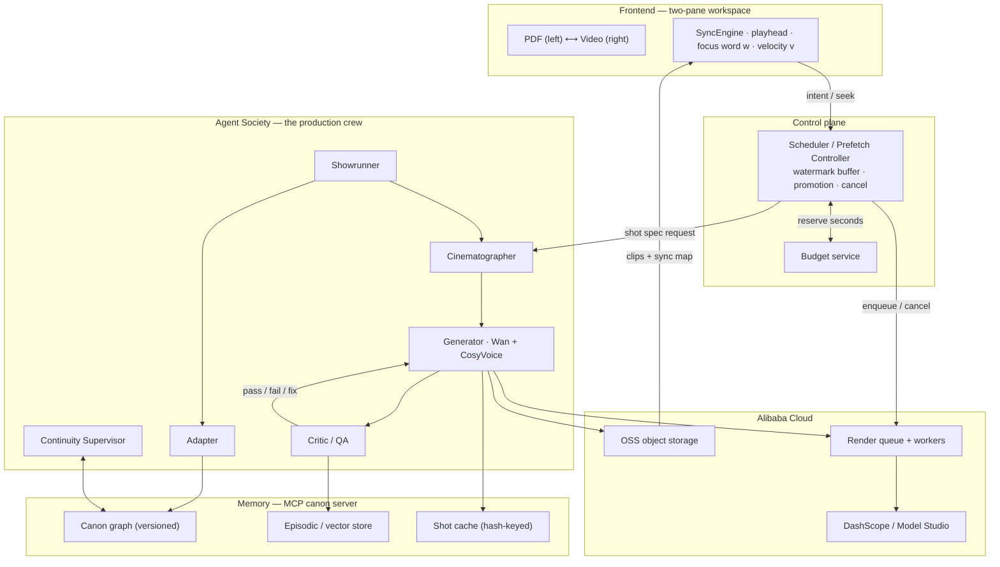

# KINORA — *watch the book*

> Turn any book or PDF into a **watchable, page-synced film that generates itself a few seconds ahead of wherever you're reading** — produced by a crew of AI agents whose shared memory keeps a feature-length adaptation visually consistent instead of melting into AI slop.

The book stays on screen. As the film plays, a narrator reads the text aloud, the exact words being spoken highlight in sync (karaoke-style), and the page turns itself to follow the playhead. You can watch, read along, or both.

|  |  |
|---|---|
| **Hackathon** | Global AI Hackathon Series with Qwen Cloud |
| **Primary track** | Track 2 — AI Showrunner (also covers Track 1 · MemoryAgent and Track 3 · Agent Society) |
| **Deadline** | Jul 9, 2026 · 2:00pm PDT |
| **Deployment** | Alibaba Cloud — ECS / Function Compute · OSS · DashScope / Model Studio |
| **Status** | **Built and runnable** — full backend + native apps (Electron desktop, a native macOS **Liquid Glass** shell, and Expo mobile), real Qwen/Wan/CosyVoice, real persistence/queue/budget. Bring up the backend with `docker compose` and the apps with `pnpm`; deploy with `infra/terraform`. |

> **Run it in 4 commands:** `cp .env.example backend/.env` (add your DashScope key) → `make stack-up` → `make seed-demo` → `make app-desktop-dev`. See [Run it locally](#run-it-locally).

---

## The two ideas that make it defensible

Most Track-2 projects do the solved party trick: *type a prompt → get a 15-second short.* The unsolved problem is **long-form consistency** — across the dozens of clips a long story needs, faces change, palettes drift, and props teleport. Kinora's bet is that this is fixable with architecture, not a bigger model:

- **Consistency is a memory problem, not a model problem.** A persistent, versioned **story canon** — what each character looks like, sounds like, where they are, and what has already happened — conditions every generated clip on the *relevant slice* of that truth. Continuity stops being a dice roll and becomes an emergent property of retrieval.
- **The film is a function of attention.** A 300-page book is ~25 minutes of video and would be insane to pre-render — most of it would never be watched. So Kinora never renders a film. It renders the **next few seconds**, just ahead of your eyes, spending its scarce video budget only on pages a human is actually arriving at, and **caching every accepted shot** so a re-read costs nothing.

These two reframes are what let a single architecture win Track 2 (the showrunner), satisfy Track 1 (the memory), and require Track 3 (the crew that maintains it).

## Why anyone cares

Kinora uses the medium that's *destroying* attention spans — short, autoplaying, scrolling video — to deliver the one thing those attention spans can no longer hold: **books.** It's reading-*adjacent*, not reading-replacing — the words stay front and center, the video pulls you through them. That makes it genuinely useful for:

- **Reluctant readers / ADHD** — the video pulls you forward; synced text keeps you reading words, not just absorbing a cartoon.
- **Dyslexia** — simultaneous audio + highlighted text is an evidence-based decoding aid.
- **Language learners** — watch the scene, hear the line, see the word, at reading pace.
- **Manga / webtoon / indie authors** — instant animated adaptations of static panels.

## How it works

### Generation-on-scroll

A reader *dwells*: a page of ~250 words takes 45–90 seconds to read but maps to only ~8–15 seconds of video. That asymmetry is the whole trick — the backend isn't racing real-time playback, it's racing reading speed, and reading is slow. The forward path is split into three zones:

| Zone | ETA window | What exists | Video budget |
|---|---|---|---|
| **Committed** | 0 – ~45s | Full video, QA-passed, narrated, cached, instantly playable | **spends video-seconds** |
| **Speculative** | ~45 – ~240s | One **keyframe still per beat** (image-gen, not video) | **~zero** |
| **Cold** | > 240s | Plan + canon only (text already analysed at import) | free |

A **dual-watermark buffer with hysteresis** (low = 25s, high = 75s of committed video ahead) makes generation *bursty and event-driven* — it fills to the high mark, then goes completely idle until the buffer drains, so the system is smooth **and** not generating all the time. Speculation is image-only, so guessing ahead is nearly free; video-seconds are spent only when a reader's trajectory confirms they're arriving. Skim too fast, seek, or put the book down, and it degrades gracefully (a Ken-Burns pan over a still keyframe) or quietly waits — never a spinner, never a stall.

### The crew (Agent Society)

Six single-purpose agents, each a separate service with a typed JSON contract, all reading and writing one shared canon through an **MCP server**. No agent holds private mutable state — the canon is the only truth.

| Agent | Job | Model |
|---|---|---|
| **Showrunner** | Plans the production, decomposes the book, **arbitrates conflicts** | Qwen3.7-Max |
| **Adapter** | PDF → screenplay → shot list (with source spans) | Qwen3.5-Plus |
| **Continuity Supervisor** | Owns canon writes; flags inconsistencies; runs forgetting/versioning | Qwen3.7-Plus |
| **Cinematographer** | Designs each shot: keyframe, camera, locked references, Wan mode | Qwen3.5-Plus (VL) |
| **Generator** | Renders the clip + narration | Wan 2.7 / HappyHorse + CosyVoice |
| **Critic / QA** | Scores each clip against the canon; decides pass / fix / regen | Qwen3-VL |

When the Continuity Supervisor catches a contradiction (e.g. *a shot depicts the heroine drawing a sword she lost three beats ago*), it raises a **structured conflict object** and the Showrunner arbitrates under a fixed policy: evolve the canon if the text supports it, surface to the director if user-facing, otherwise honor the established truth. This negotiation is surfaced live in the demo — a thing a judge can *watch happen*.

### The memory layer (MemoryAgent)

A versioned **canon graph** (characters, voices, locations, props, style, timeline) plus an **episodic vector store** of every shot ever generated and its QA scores, exposed through a small, deliberate MCP tool surface. It delivers exactly what Track 1 asks for:

- **Recall under a limited context window** — `canon.query(beat)` returns *only* what a beat needs (characters present + active location + style tokens + the previous shot's endpoint frame), never the whole book. Token cost stays flat as books get longer.
- **Timely forgetting** — facts are scoped to the beat interval where they were true; retired states drop out of forward retrieval but survive for backward (time-travel) reads.
- **Increasingly accurate across sessions** — every Director edit writes a preference signal, so the system learns this reader's taste (pacing, palette, framing) and applies it by default next time. The accumulated style is browsable and resettable (per-book or globally) in the **"Your directing style"** Settings panel on both apps (`GET`/`DELETE /me/prefs`, `/books/{id}/prefs`).
- **Free re-reads** — each shot has a content hash; a cache hit serves the clip from OSS for zero video-seconds, which also makes Director edits surgical (only the dependent shots regenerate).

## Architecture

Two planes, deliberately separated. The **control plane** (Scheduler) decides *when and what* to render against the reader's attention; the **creative/data plane** (the crew + memory + infra) decides *how* a scene looks and produces the pixels. The memory store sits at the centre as a shared blackboard, exposed to every agent as an MCP server.



The full diagram, the per-shot state machine, and the end-to-end sequence are in [`kinora.md` §6–§9](./kinora.md#6-system-architecture).

## Tech & model stack

- **Frontend** — two-pane workspace; PDF rendered with PyMuPDF (virtualised pages); a `SyncEngine` that bidirectionally binds scroll ↔ video ↔ word; events over SSE/WebSocket.
- **Models (Qwen Cloud / DashScope)** — Qwen3.7-Max (orchestration), Qwen3.7-Plus / Qwen3.5-Plus (high-volume agents), Qwen3-VL (page reading + QA), Wan 2.7 (character video: reference-to-video / first-last-frame / continuation), HappyHorse 1.0 (establishing shots), CosyVoice v3-plus (narration + voice cloning + word timestamps).
- **Backend (Alibaba Cloud)** — stateless agent services + Scheduler on ECS / Function Compute; clips, frames, audio, and the canon vault in OSS; an idempotent, cancellable, dead-lettered render queue on the managed broker.

## Project layout

```
backend/        FastAPI app, six-agent crew, MCP canon-memory server, render pipeline,
                scheduler + Redis queue, budget service, eval harness, Alembic migrations
packages/core/  shared TypeScript: SyncEngine, OpenAPI-typed API client, event schemas, stores
apps/desktop/   Electron app (electron-vite + React + Tailwind) — the two-pane reading room
apps/mobile/    Expo / React Native app (video + reflow read-along)
infra/          docker-compose.yml (the backend stack) + terraform/ (Alibaba Cloud IaC)
deploy/       alibaba_render_worker.py — the §12.6 OSS + DashScope proof artifact
assets/books/ the bundled public-domain demo book + its PyMuPDF build script
Makefile      install / stack-up / migrate / worker / mcp / seed-demo / test / …
kinora.md     the full technical design (architecture, agents, pipeline, memory, budget)
```

## The real process model

Every backend role is the same image with a different command (see `infra/docker-compose.yml`):

| Service | Command | Role |
|---|---|---|
| `api` | `uvicorn app.main:app` | REST + SSE/WS; **runs the Scheduler in-process** + the idle-sweeper; **triggers Phase-A ingest** as a background task on upload |
| `render-worker` | `python -m app.queue.worker` | Drains the Redis priority queue; runs the per-shot pipeline / the ffmpeg degradation ladder |
| `mcp` | `python -m app.mcp.run --http` | The canon-memory MCP server (the §8.3 tool surface) |
| `migrate` | `alembic -c alembic.ini upgrade head` | One-shot schema apply (runs before the app) |
| `postgres` / `redis` / `minio` | — | Postgres+pgvector · Redis · S3-compatible object storage |

There is **no** separate scheduler or ingest process — both run inside `api` (a one-shot
`python -m app.ingest.worker <book_id>` CLI exists for re-ingest).

## Run it locally

**Prerequisites:** Docker + Docker Compose, and a DashScope (Model Studio, intl) API key.

```bash
# 1. Configure secrets (backend/.env is gitignored; .env.example is the template).
cp .env.example backend/.env
#    edit backend/.env: set DASHSCOPE_API_KEY=sk-...   (KINORA_LIVE_VIDEO stays false)
#    and set TTS_MODEL=qwen3-tts-flash  (preset-voice narration; see Configuration)

# 2. Build + bring up the backend stack (data plane, migrate, api, render-worker, mcp).
make stack-up                 # == cd infra && docker compose up -d --build
#    migrations run automatically via the one-shot `migrate` service.

# 3. Seed the bundled public-domain demo book through the REAL flow (register → upload → ingest).
make seed-demo                # == python backend/scripts/seed_demo.py --via api

# 4. Run the desktop app (it connects to the API at http://localhost:8000).
make app-install              # pnpm install (first run only)
make app-desktop-dev          # launches the Electron reading room
#    API docs: http://localhost:8000/docs · Prometheus: http://localhost:9090
```

### Local dev without Docker (venv)

```bash
make install                  # backend/.venv + pip install -e .[dev]
cd infra && docker compose up -d postgres redis minio minio-bootstrap   # just the data plane
make migrate                  # alembic upgrade head
# then, in separate shells:
cd backend && .venv/bin/uvicorn app.main:app --reload     # api (scheduler + ingest in-process)
make worker                   # python -m app.queue.worker
make mcp                      # python -m app.mcp.run --http
make seed-demo SEED_ARGS="--via direct"   # or run ingest in-process, no server needed
```

### Run the apps

**Prerequisites:** Node 20+ and `pnpm` (the apps are a pnpm + Turborepo workspace).

```bash
make app-install              # pnpm install (first run)

# Desktop (Electron) — connects to the API at http://localhost:8000:
make app-desktop-dev          # == pnpm --filter @kinora/desktop dev
#   point at another backend with:  VITE_KINORA_API_URL=https://api.example.com
#   package signed installers (needs certs):  pnpm --filter @kinora/desktop dist

# Mobile (Expo) — first set the API base in apps/mobile/src/lib/config.ts
# (a phone/simulator can't reach "localhost"), then:
make app-mobile-start         # == pnpm --filter @kinora/mobile start   (press i / a)
```

## Verify the end-to-end loop

With `KINORA_LIVE_VIDEO` **off** (the default — no Wan spend), the full loop still runs end to end:

1. **Ingest** — `seed-demo` uploads the demo PDF; Phase A extracts pages + per-word boxes, runs Qwen-VL page analysis, builds the versioned canon (characters/locations/props/style), plans the shot list + source-span index, and identity-locks keyframes + voices. The book reaches `status: ready`.
2. **Session + scroll** — create a reading session and send `intent_update`s; the Scheduler fills the committed buffer under the dual-watermark and enqueues **keyframe** work across the speculative horizon (zero video-seconds).
3. **Render** — the `render-worker` drains the queue. With the live gate off it steps down the **degradation ladder** and produces a **real Ken-Burns mp4** over the locked keyframe (muxed with CosyVoice narration), surfaced as a `clip_ready` event — **zero video-seconds spent**. The budget ledger stays at 0.
4. **Go live** — flip `KINORA_LIVE_VIDEO=1` and the same committed lane renders **real Wan 2.7 video** through the Critic/cache/budget path, hot-swapping into the workspace; the budget service decrements and enforces the hard ceiling.

This loop is exercised by the backend test suite (`make test`, against throwaway Postgres+Redis+MinIO) and by `make seed-demo`.

## Configuration & the go-live gate

All config flows through typed settings (`backend/app/core/config.py`); see [`.env.example`](./.env.example) for every key. The ones that matter most:

| Setting | Default | Meaning |
|---|---|---|
| `DASHSCOPE_API_KEY` | — (**required**) | Model Studio (intl) key. Only in gitignored `backend/.env`. |
| `KINORA_LIVE_VIDEO` | `false` | **Go-live gate (§11.1).** Off = the pipeline degrades to Ken-Burns (zero Wan spend) while you iterate. On = real Wan video renders. |
| `TTS_MODEL` | `qwen3-tts-vc` | TTS model. **Set `TTS_MODEL=qwen3-tts-flash` for the demo** — ingest assigns *preset* Qwen3-TTS voices (Cherry, Ryan, …), which the `-flash` model serves; `-vc` is the voice-*clone* model and expects an enrolled voice. |
| `BUDGET_CEILING_VIDEO_S` | `1650` | Hard cap on total video-seconds. Per-session/per-scene sub-caps also apply. |
| `WATERMARK_LOW_S` / `_HIGH_S` / `COMMIT_HORIZON_S` | `25 / 75 / 45` | Scheduler buffer + promotion horizons. |

The budget service enforces the ceiling with a real append-only ledger and a transaction-scoped lock; the gate prevents silent credit burn. Real Wan renders spend real, metered DashScope credits — flip the gate on deliberately.

**Auth model — local vs cloud.** The API/MCP enforce three env values: `JWT_SECRET` (the app refuses to boot in non-local on the insecure built-in default), `MCP_AUTH_TOKEN` (the bearer the MCP server requires), and `CORS_ORIGINS` (the allowed browser origin[s]; credentialed CORS, so **no wildcard**). Locally these are pre-wired with **dev** values in `infra/docker-compose.yml` (and `APP_ENV` stays `local`, so the JWT default is tolerated), so `make stack-up` just works. In **cloud** they're real secrets provisioned + injected by Terraform/cloud-init — `jwt_secret`/`mcp_auth_token` auto-generate and `cors_origins` is required (see [Deploy to Alibaba Cloud](#deploy-to-alibaba-cloud)).

## Deploy to Alibaba Cloud

`infra/terraform/` is ready-to-apply IaC (validated with `terraform validate` + `terraform fmt`; **not** applied — it needs your credentials). It provisions VPC + security groups, **OSS** (object storage), **ApsaraDB RDS for PostgreSQL** (pgvector), **Tair/Redis**, and **ECS** nodes for `api` + `render-worker` + `mcp` — each running the same image with its role command via cloud-init.

```bash
cd infra/terraform
cp terraform.tfvars.example terraform.tfvars   # add Alibaba creds + DashScope key (gitignored)
terraform init && terraform validate && terraform plan && terraform apply
```

**Production security model (set before `apply` — it fails closed):**

| Input | Required? | What it does |
|---|---|---|
| `admin_cidr` | **yes** (no default; rejects `0.0.0.0/0`) | CIDR allowed to reach the **API (8000)** — your frontend/LB or office egress |
| `ssh_cidr` | **yes** (no default; rejects `0.0.0.0/0`) | CIDR allowed to **SSH (22)** — ideally a bastion/VPN `/32`, kept separate from app access |
| `cors_origins` | **yes** (no default; no `*`) | The deployed **frontend origin(s)**, injected as `CORS_ORIGINS` (credentialed CORS can't use a wildcard) |
| `jwt_secret` | auto-generates if empty | Injected as `JWT_SECRET` so prod never boots on the insecure built-in default |
| `mcp_auth_token` | auto-generates if empty | Injected as `MCP_AUTH_TOKEN`, the bearer the MCP server requires |

The **MCP port (8765) is intra-VPC only** (never internet-facing); the bearer token is defense-in-depth on top. cloud-init writes these into each node's env **without** shell tracing, so secrets never land in `cloud-init-output.log`. Read back the generated secrets with `terraform output -raw jwt_secret` / `-raw mcp_auth_token`. For real prod, prefer KMS / Secrets Manager / OOS over user_data.

The **apps** ([`apps/desktop`](./apps/desktop), [`apps/mobile`](./apps/mobile)) ship as native binaries rather than a served site: build signed desktop installers with `pnpm --filter @kinora/desktop dist` (electron-builder → `.dmg`/`.exe`/AppImage) and mobile builds via EAS ([`apps/mobile/eas.json`](./apps/mobile/eas.json)). Both reach the deployed API over HTTPS (`VITE_KINORA_API_URL` for desktop; `apps/mobile/src/lib/config.ts` for mobile).

The **proof-of-deployment artifact** ([`deploy/alibaba_render_worker.py`](./deploy/alibaba_render_worker.py), kinora.md §12.6) is a real render worker that demonstrably uses **OSS** + **DashScope** — it reuses the app's `ObjectStore`, `VideoProvider`, and queue worker rather than duplicating logic. See [`deploy/README.md`](./deploy/README.md) and [`infra/terraform/README.md`](./infra/terraform/README.md).

## Repository contents

| Path | What it is |
|---|---|
| [`backend/`](./backend) · [`apps/`](./apps) · [`packages/core`](./packages/core) | The built application (FastAPI backend · Electron + Expo apps · shared TS core). |
| [`infra/`](./infra) · [`deploy/`](./deploy) · [`assets/`](./assets) | Local stack + Alibaba IaC · §12.6 proof artifact · demo book. |
| [`kinora.md`](./kinora.md) | The full technical design — architecture, agents, pipeline, memory, budget. |
| [`what-is-kinora.md`](./what-is-kinora.md) | Plain-English explainer. **Start here if you're non-technical.** |
| [`hackathon_description.md`](./hackathon_description.md) | The hackathon's rules, tracks, and judging criteria. |

## Submission readiness

Tracked against the Devpost requirements (see [`hackathon_description.md`](./hackathon_description.md)):

- [x] **Open-source license** — [`LICENSE`](./LICENSE) (Apache-2.0), visible in the repo's About section
- [x] **Proof of Alibaba Cloud deployment** — [`deploy/alibaba_render_worker.py`](./deploy/alibaba_render_worker.py) uses OSS + DashScope (record it running per [`deploy/README.md`](./deploy/README.md))
- [x] **Architecture diagram** — see [Architecture](#architecture) and [`kinora.md` §6](./kinora.md#6-system-architecture)
- [ ] **~3-minute demo video** (public on YouTube / Vimeo / Facebook Video)
- [x] **Text description** of features + functionality (this README + `kinora.md`)
- [x] **Track identified** — Track 2, AI Showrunner

## License

[Apache-2.0](./LICENSE).
