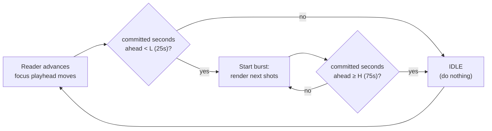
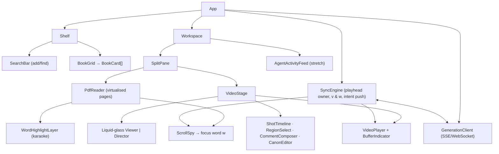
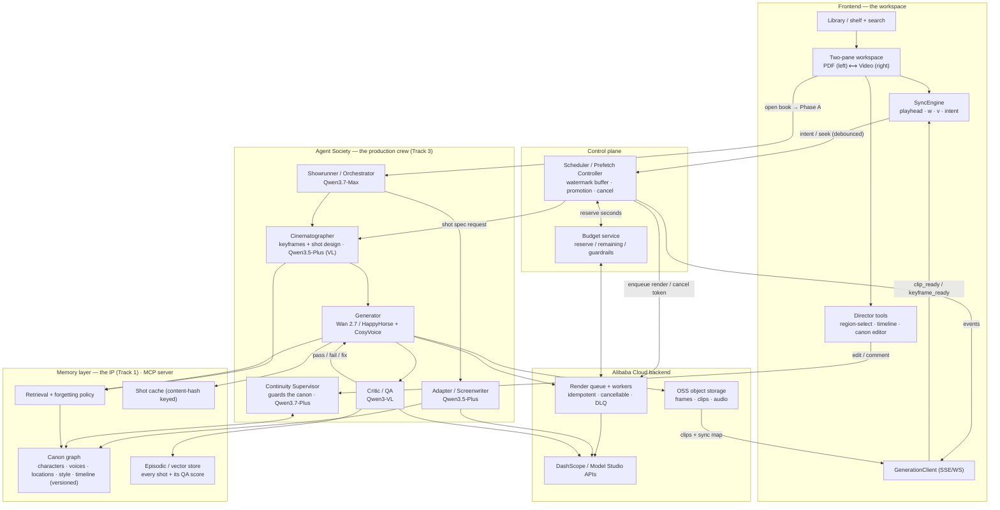
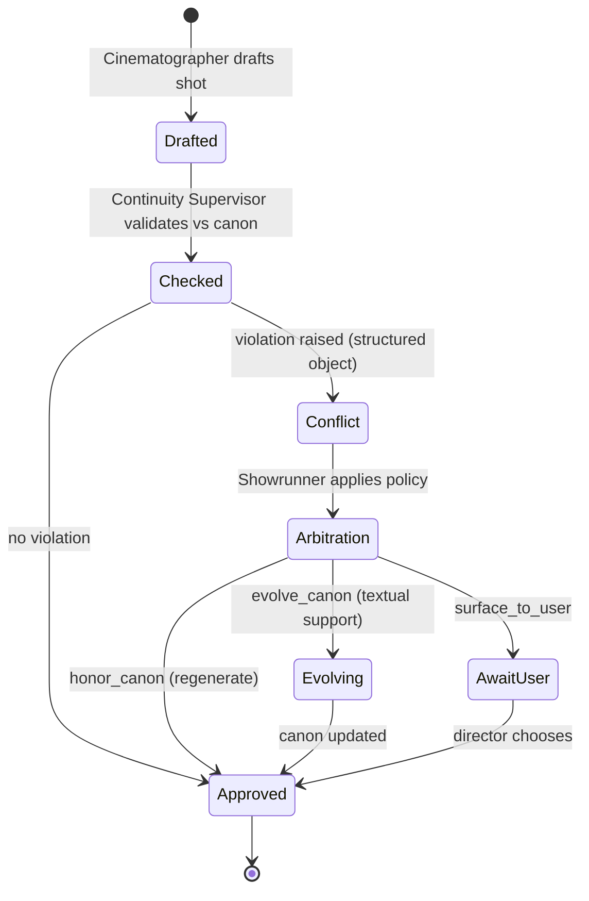
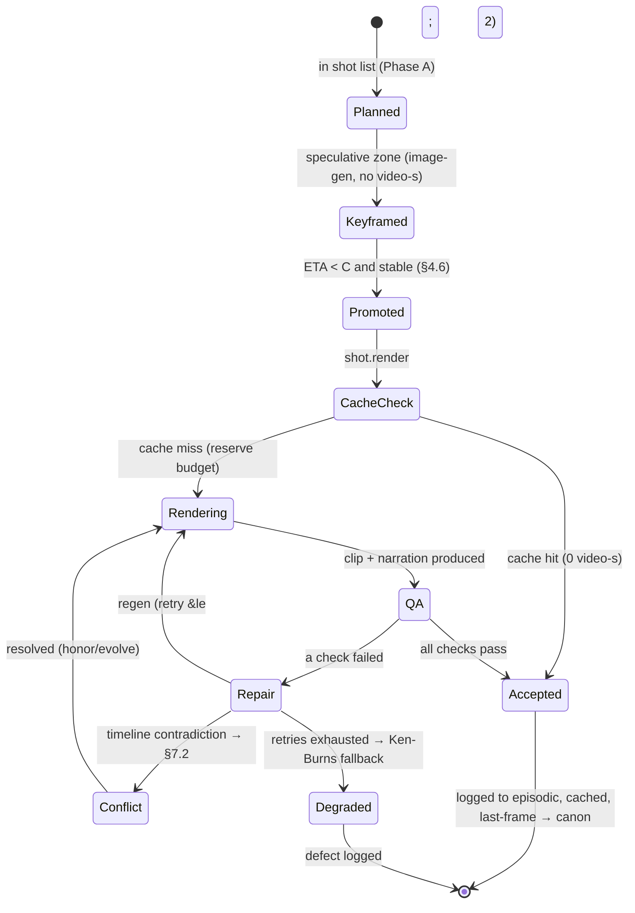
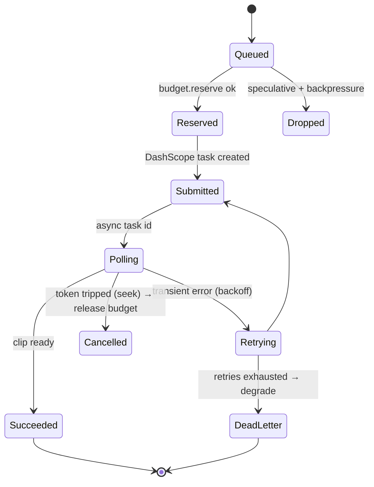

# KINORA — *watch the book*

> **Working name.** A "Kinora" was an early-1900s home device that spun a reel of still photographs fast enough to read as motion — a book you could *watch*. Alternatives: **Reverie**, **Flipreel**, **Vellum**. Pick whatever clears a domain. The name is the one thing in this document that doesn't matter.

| | |
|---|---|
| **Primary track** | Track 2 — AI Showrunner |
| **Secondary coverage** | Track 1 (MemoryAgent) + Track 3 (Agent Society) |
| **Submission deadline** | Jul 9, 2026 · 2:00pm PDT |
| **Deployment target** | Alibaba Cloud (ECS / Function Compute · OSS · managed queue · DashScope / Model Studio) |
| **Free-tier ceiling** | ~1,650 video-seconds + ~70M tokens, 90 days, Singapore endpoint |

---

## Table of contents

1. [One-liner](#1-one-liner)
2. [The bet](#2-the-bet-read-this-first)
3. [Why anyone cares](#3-why-anyone-cares-the-hook)
4. [Generation-on-scroll — the core consumption model](#4-generation-on-scroll--the-core-consumption-model)
5. [The product & UI](#5-the-product--ui)
6. [System architecture](#6-system-architecture)
7. [The crew — agents & the negotiation protocol](#7-the-crew--agents--the-negotiation-protocol)
8. [The memory layer — the MCP canon server](#8-the-memory-layer--the-mcp-canon-server)
9. [The generation pipeline](#9-the-generation-pipeline)
10. [Prompt contracts](#10-prompt-contracts)
11. [Model stack & budget accounting](#11-model-stack--budget-accounting)
12. [Engineering — the unglamorous 30%](#12-engineering--the-unglamorous-30)
13. [Metrics & the eval harness](#13-metrics--the-eval-harness)
14. [How it maps to — and beats — the rubric](#14-how-it-maps-to--and-beats--the-rubric)
15. [Build plan — 18 days](#15-build-plan--18-days)
16. [Demo script](#16-demo-script--3-minutes)
17. [Submission checklist](#17-submission-checklist-devpost)
18. [Open questions](#18-open-questions-to-lock-before-you-build)

---

## 1. One-liner

Kinora turns any book or PDF into a watchable, page-synced film that **generates itself a few seconds ahead of wherever you're reading** — produced by a crew of agents whose shared memory is what keeps a feature-length adaptation visually consistent instead of melting into AI slop.

The two ideas that make it defensible: **consistency is a memory problem, not a model problem**, and **the film is a function of attention — generated on demand against your reading position, never pre-rendered in bulk.** Everything below is in service of those two sentences.

## 2. The bet (read this first)

Every other Track-2 team builds the same thing: *type a prompt → get a 15-second short.* That is the solved party trick. Judges have seen 200 of them; it loses on novelty alone.

The unsolved problem is **long-form consistency.** You cannot one-shot a long video. You must cut it into clips and stitch them, and the seams are exactly where characters change faces, palettes drift, and props teleport. The industry instinct — "throw a bigger video model at it" — is wrong, because drift is not a fidelity failure of any single clip; it is the absence of a shared source of truth *across* clips.

**Thesis A — consistency is memory.** If a persistent system holds the canonical truth of the story (what each character looks like, sounds like, where they are, what has already happened) and conditions every generated clip on the *relevant slice* of that truth, then continuity stops being a dice roll and becomes an emergent property of retrieval. That single reframe is what lets one architecture win Track 2 (the showrunner), satisfy Track 1 (the memory), and require Track 3 (the crew that maintains it).

**Thesis B — the film is a function of attention.** A 300-page book is roughly 25 minutes of video, which exceeds the *entire* free-tier budget several times over and would be insane to pre-render — most of it would never be watched. So Kinora never renders a film. It renders the **next few seconds**, just ahead of the reader's eyes, spending video-seconds only on pages a human is actually arriving at, and caching every accepted shot so a re-read costs nothing. This is simultaneously the product's defining interaction *and* the reason it fits inside 1,650 seconds. Section 4 is the engineering of this idea and is the heart of the submission.

Thesis B is also why we win the **budget** sub-criterion outright: a naive pipeline pre-renders the book and burns the budget on unseen footage; Kinora's spend is bounded by reading, deduplicated by memory, and degraded gracefully under pressure.

## 3. Why anyone cares (the hook)

Kinora uses the medium that is destroying attention spans — short, autoplaying, scrolling video — to deliver the one thing those attention spans can no longer hold: books. Anti-brainrot, built out of brainrot's own materials.

It is **reading-adjacent, not reading-replacing.** The book stays on screen. As the film plays, narration reads the text aloud, the exact words being spoken highlight in sync (karaoke-style, not closed captions), and the page turns itself to follow the playhead. You can watch, read along, or both. That makes it genuinely useful:

- **Reluctant readers / ADHD** — the video pulls you forward; the synced text keeps you reading words, not just absorbing a cartoon.
- **Dyslexia** — simultaneous audio plus highlighted text is an evidence-based decoding aid.
- **Language learners** — watch the scene, hear the line, see the word, at reading pace.
- **Manga / webtoon / indie authors** — instant animated adaptations of static panels.

That is the Problem Value & Impact (25%) story, and the emotional beat the 3-minute demo opens on.

---

## 4. Generation-on-scroll — the core consumption model

This is the section the rest of the document hangs from. The requirement: **video must be generated as the reader scrolls — smoothly, with no visible buffering, and without the system generating constantly.** Those three constraints pull against each other, and resolving them is the architecture.

### 4.1 The asymmetry that makes this possible

Generating a 5-second clip is slow — call it 30–90s of wall-clock on Wan 2.7. Naively, keeping video "ahead" of a viewer watching at 1× would require sustaining ~12× real-time generation throughput. That is impossible with a sane worker count, and it is why people assume on-the-fly generation can't be smooth.

But Kinora's reader is not watching at 1×. **A reader dwells.** A page of ~250 words at a video-assisted reading pace occupies **45–90 seconds of wall-clock**, and that page maps to only **~8–15 seconds of video** (two or three shots). So the rate at which a reader *consumes* video-seconds is far below real-time: roughly **0.15–0.30 video-seconds consumed per wall-clock second.**

That asymmetry is the entire trick. During the 60 seconds a reader spends on page *N*, the backend has 60 seconds of wall-clock to produce the ~10 seconds of video for page *N+1* — which even **2–3 parallel workers** clear comfortably. We are not racing real-time playback; we are racing *reading speed*, and reading is slow. The buffer is therefore measured in **reading-time ahead**, not bytes, and reading-time is generous.

The one reader who breaks this is the **fast skimmer** flipping pages faster than any pipeline can render. For them we degrade (§4.4) — and a skimmer is not studying the animation anyway, so a Ken-Burns pan over a still keyframe is an honest answer, not a failure.

### 4.2 Units: book → scene → shot → beat, and the source-span index

Generation is never "per page" because pages don't map cleanly to motion. The hierarchy:

- **Book** — the whole work.
- **Scene** — a narrative unit, usually one to two pages; the stitching boundary.
- **Shot** — a single generated clip, ~5s; the unit the buffer and the queue operate on.
- **Beat** — the smallest planning atom: a sentence-or-two of narrative intent. One beat → one shot (usually).

Every shot carries a **source span** that ties it back to the exact text it depicts:

```json
{
  "shot_id": "shot_00042",
  "beat_id": "beat_0034",
  "scene_id": "scene_005",
  "source_span": { "page": 12, "para": 3, "word_range": [4501, 4560] },
  "est_duration_s": 5.0,
  "est_cost": { "video_seconds": 5.0, "tokens": 1850 }
}
```

The collection of source spans is the **source-span index**: a sorted map from global word-index → shot. This index is what converts a scroll position into a render decision in O(log n), and it is built once, cheaply, during ingest Phase A (§9.1). It is the literal bridge between the UI and the generator: scroll position resolves to a word index, the word index resolves to a shot, and the shot is either cached, in-flight, or cold.

### 4.3 The reading-position model

The client maintains a small, continuously updated estimate of where the reader is and how fast they're moving.

- **Focus word index `w`.** The PDF reader computes the word nearest the *reading line* — the top third of the viewport, not the centre, because eyes lead the scroll. `w` is the canonical "where am I" signal.
- **Reading velocity `v`.** An exponentially-weighted moving average of words passed per second over a 10-second window, clamped to `[0.5×, 3×]` of a 4 words/sec default (≈240 wpm). Clamping stops a single flick of the trackpad from spiking the estimate.
- **Direction.** Forward by default; backward is supported and simply re-targets the buffer behind `w` (almost always a cache hit, since you already rendered it).
- **Mode.** `viewer` (video drives) or `director` (reader drives); see §5.2 for the arbiter that prevents the two from fighting.

From `w` and `v` the client derives the single quantity the scheduler needs: the **ETA to any future shot** = `(shot.word_range.start − w) / v`, in seconds of reading-time.

### 4.4 Three zones, and why speculation costs no video-seconds

The reader's forward path is divided into three zones, defined by ETA. Each zone has a different, deliberately chosen *representation* — and the representations are designed so that speculation is nearly free against the scarce video budget.

| Zone | ETA window | What exists | Cost against the 1,650s |
|---|---|---|---|
| **Committed** | 0 – ~45s | Full Wan video, QA-passed, narrated, cached, instantly playable | **Spends video-seconds** |
| **Speculative** | ~45 – ~240s | One **keyframe still per beat** (image-gen, not video) | **~zero** video-seconds |
| **Cold** | > 240s | Plan + canon only (text already analysed in Phase A) | free |

The critical design decision: **the speculative zone uses images, not video.** A keyframe is produced by image generation (or pulled from the canon's locked character/location references), which does *not* draw down the 1,650 video-seconds. If a reader reaches a speculative beat before its full clip is ready, the client shows that still with a **client-side Ken-Burns pan** — a slow zoom/drift rendered in canvas/CSS, zero generation cost, indistinguishable-enough from "a slow establishing shot" to hold the moment. Video-seconds are spent **only** at promotion into the committed zone (§4.6), and only once the reader's trajectory confirms they're actually arriving. You never pay the scarce currency on a guess.

This is also the **degradation ladder** (formalised in §12.4): full video → animatic/Ken-Burns over a keyframe → the book's own illustration → plain narrated text. The film never hard-stops; it gracefully loses fidelity under budget or latency pressure and silently regains it.

### 4.5 The watermark buffer — smooth *and* not-always-generating

Naively triggering generation on every scroll event produces two failures at once: constant thrash (generating all the time) and stutter (generating the wrong thing). The fix is a **dual-watermark buffer with hysteresis**, the same pattern a video player uses to fill its byte buffer — except our buffer is measured in **committed video-seconds ahead of the focus playhead.**

- **Low watermark `L = 25s`.** When committed-seconds-ahead drops below `L`, the scheduler starts a generation burst.
- **High watermark `H = 75s`.** The burst renders shots forward until committed-seconds-ahead reaches `H`, then **stops completely.**

Between `L` and `H` the system is **idle** — no generation. It only wakes when the buffer drains past `L` again as the reader advances. This hysteresis band is precisely what gives you "smooth" (you always have ≥25s ready) *and* "not generating all the time" (you do nothing in the 50-second band between watermarks). Generation is **bursty and event-driven by buffer drain**, never a continuous background grind.



### 4.6 Velocity-adaptive promotion

What turns a *speculative keyframe* into *committed full video* is the ETA crossing the **commit horizon `C = 45s`** — but only when the reader's trajectory is stable.

```
for each beat B in the speculative zone, in reading order:
    eta = (B.word_range.start - w) / v
    if eta < C and trajectory_is_stable() and budget.can_afford(B.est_video_seconds):
        promote(B)            # enqueue full Wan render at committed priority
    else:
        ensure_keyframe(B)    # cheap image only; no video-seconds
```

Because `eta` divides by velocity, the system **self-tunes to the reader.** A fast reader has a large `v`, so distant beats cross the 45s commit horizon sooner and are promoted earlier and in greater number — exactly when you need more lead time. A slow reader promotes lazily, conserving budget. No manual tuning per user; the velocity term does it.

`trajectory_is_stable()` returns false during rapid skim (velocity above the clamp ceiling or oscillating direction), which suspends promotion so you don't burn video-seconds on pages a skimmer will blow past. During instability you ride the keyframe ladder.

### 4.7 Debounce, dwell, idle-pause

Three timers keep the scheduler from reacting to noise:

- **Scroll-settle debounce (200ms).** The "intent position" sent to the backend updates only after scrolling pauses for 200ms. Mid-flick scroll deltas never reach the scheduler.
- **Dwell confirmation.** A beat is only promoted once `w` has been *moving toward it* for two consecutive settle windows — a momentary overshoot (reader scrolls past, scrolls back) doesn't trigger a render down the wrong path.
- **Idle-pause (8s).** If there is no scroll and no playback for 8 seconds — the reader put the book down, took a call, is thinking — **all speculative generation halts** and in-flight speculative jobs are allowed to finish but nothing new is enqueued. The committed buffer is preserved so resumption is instant. This is the single biggest defence against "generating all the time": an idle reader generates nothing.

### 4.8 Seek and skip — cancellation, instant bridge, re-seed

When the reader jumps — taps a far page, scrubs the shot timeline, uses search, or the video-driven page-turn lands somewhere unexpected — the buffer built for the old trajectory is suddenly worthless. The handler, in order:

1. **Cancel** in-flight speculative renders whose target is now > 120s of reading-time from the new position. Each render job carries a cancellation token; the queue supports cooperative cancel (§12.1). Committed-zone jobs near the *new* position are never cancelled.
2. **Bridge instantly.** Show the new position's keyframe (always cheap-available from Phase A) under a Ken-Burns pan *immediately*, so the reader sees something coherent within one frame while real video renders. No spinner.
3. **Re-seed.** Reset the focus playhead to the new `w`, re-run the watermark fill (§4.5) from the new position. Velocity resets to the default until two fresh samples arrive.

Cache makes backward seeks essentially free: re-reading a passage replays accepted shots straight from OSS (§9.7), no regeneration.

### 4.9 The Scheduler service (control plane)

The brain of generation-on-scroll is a dedicated control-plane service — the **Scheduler / Prefetch Controller** — distinct from the creative Showrunner agent. The Showrunner decides *what a scene should look like*; the Scheduler decides *what to render right now and what to leave cold.* Keeping them separate keeps the six creative agents clean and the scroll logic testable in isolation.

Per active reading session the Scheduler holds:

```json
{
  "session_id": "sess_7af3",
  "book_id": "book_grimm_snow",
  "focus_word": 4523,
  "velocity_wps": 3.8,
  "committed_seconds_ahead": 41.0,
  "inflight": { "committed": ["shot_00043","shot_00044"], "speculative": ["shot_00051"] },
  "budget_remaining_s": 1287.5,
  "last_activity_ms": 1718000000000
}
```

Its control loop, on every debounced intent update or job-completion event:

```python
def on_event(session):
    if idle(session):                      # §4.7
        cancel_speculative(session); return
    refresh_committed_ahead(session)       # recompute from cache + inflight
    # 1. keep the committed buffer between watermarks (§4.5)
    while session.committed_seconds_ahead < H and budget_ok(session):
        shot = next_uncommitted_shot(session.focus_word)
        if eta(shot, session) < C and stable(session):
            enqueue(shot, priority=COMMITTED, token=new_token(session))
            session.committed_seconds_ahead += shot.est_duration_s
        else:
            break
    if session.committed_seconds_ahead >= H:   # hit high watermark -> idle the committed lane
        pass
    # 2. maintain cheap keyframes across the speculative horizon (no video-seconds)
    for beat in speculative_horizon(session, C, SPEC_HORIZON=240):
        ensure_keyframe(beat)              # image-gen / canon ref, preemptible, low priority
    # 3. enforce caps & backpressure (§12.2)
    trim_speculative_to_cap(session, max_spec=2)
```

Concurrency caps: **4 committed render slots** (these preempt) **+ 2 speculative slots** (preemptible, droppable under backpressure). Keyframe image jobs run on a separate, cheaper lane with its own small pool. When the render queue saturates, *speculative* enqueues are dropped (not queued unbounded); *committed* enqueues preempt speculative ones in flight.

### 4.10 Worked example (real numbers)

Reader opens a Grimm fairy tale, starts at word 0, settles to `v = 4 wps`.

- **t=0:** Scheduler sees `committed_ahead = 0 < L`. Burst begins. Shots 1–15 cover the first ~75s of video. It promotes shots whose ETA < 45s: at 4 wps and ~5s-of-video per ~30 words, that's roughly the next ~6 shots. It enqueues 4 at COMMITTED priority (slots full), holds 2. Keyframes for the speculative horizon (the next ~4 minutes of beats) render on the cheap lane in parallel — **zero video-seconds.**
- **t≈12s:** First clip is ready (well before the reader, dwelling on page 1, needs it). Committed-ahead climbs toward `H=75s`. Once it hits 75s, **the committed lane goes idle.** The system is now silent except for finishing keyframes.
- **t=60s:** Reader turns to page 2. Focus playhead advances; committed-ahead has decayed to ~55s — still above `L`, so **still idle.** No thrash.
- **t≈95s:** committed-ahead crosses below 25s. **One short burst** refills to 75s. Then idle again.
- **Reader pauses 30s to think (t≈140s):** idle-pause fires at +8s; speculative keyframe generation halts; committed buffer frozen and ready. **Generation cost during the pause: zero.**
- **Reader skips to chapter 3 (page 40):** speculative jobs for pages 2–6 cancel; page-40 keyframe bridges instantly under a Ken-Burns; buffer re-seeds; first page-40 clip lands in ~12s while the reader is still settling into the new page. No spinner, no stall.

Net behaviour: **always ≥25s of video ready, generation only in short bursts at buffer-drain, nothing at all while idle, and not one video-second spent on a page the reader skipped.** That is the requirement, satisfied mechanically.

### 4.11 Failure modes and the guarantees that cover them

The design is best understood by the failures it is built to absorb. This table is also the answer sheet for the question a judge *will* ask — "what happens when…":

| Failure | What goes wrong without a guard | The mechanism that covers it |
|---|---|---|
| Reader reads faster than render | Buffer drains, video stalls | Velocity-adaptive promotion (§4.6) raises lookahead as `v` rises; below the floor, the keyframe/Ken-Burns ladder fills the gap with no stall |
| Reader skims/flips wildly | Pipeline thrashes, budget burns on skipped pages | `trajectory_is_stable()` suspends promotion (§4.6); speculation stays image-only (§4.4) |
| Reader seeks far away | Buffer is now useless; in-flight renders wasted | Cancel distant speculative jobs, bridge instantly with a keyframe, re-seed (§4.8) |
| Reader idles | System keeps generating into the void | Idle-pause halts speculation after 8s; committed buffer frozen and ready (§4.7) |
| A render fails repeatedly | Pipeline blocks on one shot | Retries → DLQ → drop to Ken-Burns; the film never hard-stops (§12.1, §12.4) |
| A clip drifts (wrong face) | Slop ships to the reader | Critic catches CCS < 0.85, regenerates with tightened refs; retry cap → degrade (§9.5) |
| A shot contradicts the story | Continuity error ships | Critic flags timeline violation → Continuity Supervisor → Showrunner arbitration (§7.2) |
| Budget runs low | Generation simply stops mid-book | Budget-aware degradation rides the keyframe ladder; `budget_low` notifies the UI (§11.1) |
| Two sessions request the same shot | Pay twice for identical output | Request-level dedup on in-flight `shot_hash` (§12.3) |
| Director edits the canon | Full re-render blows the budget | Hash-scoped surgical re-render: only dependent shots regenerate (§8.7) |
| Reader re-reads a passage | Re-pay for already-good footage | Shot cache hit → zero video-seconds (§8.7) |

Every row maps "generation-on-scroll" from a slogan to a system property, and every guard is cheap — the expensive thing (video) is the thing most aggressively protected.

---

## 5. The product & UI

### 5.1 The shelf (landing)

An Apple Books–style bookshelf, deliberately clean: cover thumbnails on a neutral ground, a single search bar to find an existing book or add one (PDF / EPUB upload, or a public-domain title by name). Adding a book kicks off **ingest Phase A** (§9.1) — cheap, token-only analysis that builds the canon and the source-span index — shown as a thin progress strip on the cover ("preparing… 60%"). No video is generated at import. Tapping a prepared book opens its dedicated **workspace.**

### 5.2 The workspace — two panes and the SyncEngine

Two panes. **Left:** the book itself, rendered as real PDF pages (PyMuPDF-rasterised, virtualised so only visible pages are in the DOM). **Right:** the generated video stage. A **liquid-glass segmented control** (the Loom-style switch) flips the right pane between **Viewer** and **Director.**

The two panes are bound by the **SyncEngine**, a client-side controller that is the single source of truth for the playhead and the most subtle piece of frontend logic in the app, because it must support **bidirectional** linkage without a feedback loop:

- **In Viewer mode, video drives the page.** As the clip plays, sync-map page-turn events (§9.4) scroll/flip the PDF to follow.
- **When the reader scrolls the PDF, scroll drives the video.** The focus word resolves (via the source-span index) to a shot and an in-shot timestamp, and the video seeks there.

If both directions fire at once you get an oscillation (video turns page → scroll handler seeks video → video turns page…). The SyncEngine prevents this with a **control-owner token**: whoever last received *explicit user input* owns the playhead for a 1.2s grace window. Manual scroll grabs ownership and suppresses video-driven turning during the grace; when the reader stops touching the PDF and video is playing, ownership reverts to the video. One owner at a time, with a timeout — the standard fix for two-way binding loops, made explicit.

The SyncEngine is also the client half of generation-on-scroll: it computes `w` and `v` (§4.3), pushes debounced intent-position updates to the Scheduler, and listens for `clip_ready` events to hot-swap the video source seamlessly (preload the next clip into a hidden buffer element, switch on a clean frame boundary).

### 5.3 Viewer mode

Just watch. Narration plays; the **exact words being spoken highlight in sync** (karaoke, driven by CosyVoice word timestamps in the sync map, §9.4 — a moving highlight on the rendered text layer, not a caption box); the page turns itself to stay locked to the playhead. A deliberately subtle **buffer indicator** (a faint hairline that fills toward `H`) is the *only* surfacing of the generation machinery — present so a curious judge sees it working, quiet enough that a reader never thinks about it.

### 5.4 Director mode

The reader takes over the production. Four tools:

- **Pointer-based commenting** — exactly the Codex/Cursor region-select interaction. Drag a box over any part of a frame; the client screenshots that region, attaches it to a natural-language note, and routes the pair to the right agent (§7). "Make her coat red" → Cinematographer + Continuity. "This shot is too fast" → Cinematographer (pacing). "Wrong room" → Continuity. Routing is by a small intent classifier (a cheap Qwen call) over the note text plus the region's bound shot.
- **Stop-frame & shot timeline** — a filmstrip of the scene's shots; scrub, select, and target an individual shot for a comment or regen. Each shot tile shows its QA badge (CCS, pass/fail) so the reader sees *why* a shot looks the way it does.
- **The canon editor** — the memory graph (§8) rendered inspectable and **editable at any time.** Change a character's appearance description, swap a locked reference image, retune a style token (palette, lens, art direction). On save, the editor computes which shots depend on the changed entity (via the reference-set in each shot record) and **regenerates only those** — surgical, not a full re-render. This is the canon-editing requirement made concrete and budget-safe.
- **(Stretch) Live agent-activity feed** — a streaming log of agent messages and conflict resolutions (§7), turning the multi-agent negotiation into something a judge can *watch happen.*

Every director edit **writes back into memory** (§9.6), so the system accumulates *this reader's* directing preferences — pacing, palette, framing — and applies them by default in later sessions. That is the cross-session preference-learning Track 1 asks for, surfaced as a feature rather than a footnote.

### 5.5 Component tree & client event flow



### 5.6 Transport — the event channel

The backend pushes generation events to the client over **Server-Sent Events** (one-way, simplest) or a WebSocket if Director-mode round-trips warrant it. Event types:

| Event | Payload | Client action |
|---|---|---|
| `keyframe_ready` | `{beat_id, oss_url}` | cache still for Ken-Burns bridge |
| `clip_ready` | `{shot_id, oss_url, sync_segment}` | preload + hot-swap video source |
| `scene_stitched` | `{scene_id, oss_url, sync_map}` | replace per-shot playback with stitched scene |
| `regen_done` | `{shot_id, oss_url, qa}` | swap a single shot after a Director edit |
| `budget_low` | `{remaining_s}` | drop to keyframe ladder, show quiet notice |
| `agent_activity` | `{agent, message, conflict?}` | append to the live feed |
| `conflict_choice` | `{conflict_id, options[]}` | prompt the Director to choose (§7) |

Client → backend (REST or WS): `intent_update{session_id, focus_word, velocity, mode}`, `seek{word}`, `comment{shot_id, region_png, note}`, `canon_edit{entity}`.

---

## 6. System architecture

Two planes, deliberately separated. The **control plane** (Scheduler) decides *when and what* to render against the reader's attention; the **creative/data plane** (the crew + memory + infra) decides *how* a scene looks and produces the pixels. The memory store sits at the centre as a shared blackboard, exposed to every agent as an **MCP server** — which is also what scores the "sophisticated MCP integration" points in Technical Depth.



The data plane is **stateless agents over shared canon**: every agent is an independently deployable service whose only shared dependency is the MCP memory server. That is what lets them scale horizontally and be swapped one at a time, and it is the architectural claim that earns the Innovation points (§14).

---

## 7. The crew — agents & the negotiation protocol

Six roles. Each is a separate service with a **typed contract** — a JSON request/response schema — and each reads and writes the same canon through the MCP server. No agent holds private mutable state; the canon is the only truth.

| Agent | Job | Model | Reads | Writes |
|---|---|---|---|---|
| **Showrunner** | Plans the production, decomposes the book into scenes, assigns work, **arbitrates conflicts** | Qwen3.7-Max (used sparingly — the expensive one) | canon summary, conflict objects | scene plan, conflict resolutions |
| **Adapter / Screenwriter** | PDF → screenplay → shot list (dialogue, action, described visuals, mood) | Qwen3.5-Plus | page text + layout | beats, shot list, source spans |
| **Continuity Supervisor** | **Owns write-access to the canon.** Flags inconsistencies, runs forgetting/versioning. *The "agent that speaks to the book."* | Qwen3.7-Plus | full canon + proposed shots | canon entities, continuity states, conflict flags |
| **Cinematographer** | Designs each shot: keyframe prompt, camera/motion, **which reference images to lock**, chosen Wan mode | Qwen3.5-Plus (multimodal) | canon slice for the beat | shot spec |
| **Generator** | Renders the clip + narration; writes outputs to OSS | Wan 2.7 / HappyHorse + CosyVoice | shot spec | clip, last-frame, audio, word timestamps |
| **Critic / QA** | Watches each clip, scores it against the canon, decides pass / fix / regen | Qwen3-VL | clip + canon slice | QA record (episodic) |

### 7.1 A typed contract (example: Cinematographer)

```json
// request
{
  "beat_id": "beat_0034",
  "canon_slice": { /* result of canon.query, §8.3 */ },
  "director_notes": [{ "shot_id": "shot_00042", "note": "slower, wider", "region_png": "oss://..." }]
}
// response — a shot spec
{
  "shot_id": "shot_00042",
  "render_mode": "reference_to_video",
  "prompt": "Elsa stands at the frozen window, snow drifting; slow push-in, cool palette",
  "negative_prompt": "extra fingers, warped face, modern objects",
  "reference_image_ids": ["char_elsa_001@v3", "loc_window@v1"],
  "camera": { "move": "push_in", "speed": "slow", "shot_size": "medium" },
  "seed": 88123,
  "target_duration_s": 5.0,
  "end_frame_ref": null
}
```

Typed contracts are what make the crew swappable and the system debuggable: any agent can be replaced by a better model behind the same schema, and every message is a logged, inspectable artifact.

### 7.2 The negotiation protocol — the Track-3 money shot

Track 3 explicitly rewards showing "how agents resolve disagreements and execution conflicts." Conflicts are **first-class structured objects** raised onto the blackboard, not ad-hoc prose. The canonical demo conflict:

```json
{
  "conflict_id": "cf_001",
  "raised_by": "continuity_supervisor",
  "type": "canon_violation",
  "shot_id": "shot_00051",
  "claim": "shot depicts the heroine drawing a sword",
  "canon_fact": "state_hero_sword_001 retired at beat_0034 (sword lost in the river)",
  "current_beat": "beat_0039",
  "options": [
    { "id": "honor_canon", "action": "regenerate empty-handed", "cost_video_s": 5 },
    { "id": "surface_to_user", "action": "ask the director to choose", "cost_video_s": 0 },
    { "id": "evolve_canon", "action": "assert sword reacquired", "requires": "textual support" }
  ]
}
```

The Showrunner resolves it with a **decision record** under a fixed policy:

```
if option "evolve_canon" has textual support in the source span:
    -> evolve_canon            # the story genuinely changed; update canon, regenerate
elif director is present and conflict.user_facing:
    -> surface_to_user         # emit conflict_choice event, await the reader's pick
else:
    -> honor_canon             # safe default: respect the established truth
log(decision, reasoning) -> episodic store
```



Surface this live during the demo (the agent-activity feed). **Conflicts resolved + the measurable efficiency gain over a single-agent baseline (§13)** is exactly what the rubric rewards, and it is a thing a judge can watch rather than take on faith.

---

## 8. The memory layer — the MCP canon server

This is the part you over-invest in, because it is simultaneously the Track-1 submission, the consistency engine, and the budget optimiser. Two stores, one access protocol.

### 8.1 The Canon Graph (structured, human-inspectable)

The story's bible. Back it with an Obsidian-style markdown vault for inspectability **plus** a graph + vector index for retrieval — the vault is what a judge can open and read, the index is what agents query in milliseconds.

**Character node** — note the appearance embedding (for the Critic's similarity check) and the *locked* reference set:

```json
{
  "id": "char_elsa_001",
  "type": "character",
  "name": "Elsa",
  "aliases": ["the Snow Queen"],
  "appearance": {
    "description": "young woman, platinum braid, ice-blue gown, pale skin",
    "embedding": [/* 768-d CLIP-style appearance vector */],
    "reference_images": [
      { "oss_url": "oss://.../char_elsa_001/ref_front.png", "pose": "front", "locked": true },
      { "oss_url": "oss://.../char_elsa_001/ref_three_quarter.png", "pose": "3q", "locked": true }
    ]
  },
  "voice": {
    "cosyvoice_voice_id": "vc_elsa_8f2a",
    "reference_audio_url": "oss://.../char_elsa_001/voice_ref.wav",
    "params": { "speed": 1.0, "pitch": 0 }
  },
  "first_appearance": { "page": 3, "beat_id": "beat_0007" },
  "version": 3,
  "valid_from_beat": "beat_0001",
  "valid_to_beat": null,
  "supersedes": "char_elsa_002"
}
```

**Location**, **Prop**, and **Style** nodes follow the same shape (description + embedding + locked references). The **Style** node carries the palette, lens, and art-direction tokens that every shot in a scene is conditioned on, so the look is a retrieved constant, not a per-shot whim.

**Continuity-state node** — the *versioned fact* that makes timely forgetting possible. A fact is true only over a beat interval:

```json
{
  "id": "state_hero_sword_001",
  "subject": "char_hero_001",
  "predicate": "possesses",
  "object": "prop_sword_001",
  "valid_from_beat": "beat_0012",
  "valid_to_beat": "beat_0034",   // lost at beat 34 → no longer active after this
  "version": 1,
  "source_span": { "page": 8, "char_range": [1203, 1280] }
}
```

### 8.2 The Episodic / Vector store

Every shot ever generated — its prompt, seed, references, output URL, and the Critic's scores — embedded for retrieval. This is the "what worked before" memory that makes generation *increasingly accurate across sessions*, the exact Track-1 phrasing.

```json
{
  "shot_id": "shot_00042",
  "scene_id": "scene_005", "beat_id": "beat_0034",
  "source_span": { "page": 12, "para": 3, "word_range": [4501, 4560] },
  "status": "accepted",
  "render_mode": "reference_to_video",
  "prompt": "...", "negative_prompt": "...", "seed": 88123,
  "reference_set_hash": "sha1:af83…",
  "reference_image_ids": ["char_elsa_001@v3", "loc_window@v1"],
  "duration_s": 5.0,
  "output": { "clip_url": "oss://.../clip.mp4", "last_frame_url": "oss://.../last.png" },
  "narration": { "text": "...", "audio_url": "oss://.../narr.wav", "word_timestamps": [/* … */] },
  "qa": { "ccs": 0.91, "style_drift": 0.04, "timeline_ok": true, "score": 0.88, "verdict": "pass" },
  "cost": { "video_seconds": 5.0, "tokens": 1840 },
  "embedding": [/* shot embedding for dedup + retrieval */],
  "canon_version_at_render": 7,
  "created_at": "…", "accepted_at": "…"
}
```

### 8.3 The MCP tool surface

The memory server exposes a small, deliberate set of tools — wire two of them as **custom Qwen skills** (`canon.query` and `shot.render`) so the API usage reads as designed, not bolted on (Technical Depth).

| Tool | Signature | Purpose |
|---|---|---|
| `canon.query` | `(beat_id, kinds?) → canon_slice` | **The retrieval policy.** Returns only what this beat needs: characters present + active location + style tokens + last accepted endpoint frame. Never the whole book. |
| `canon.get_entity` | `(id, at_beat?) → entity` | Resolve a versioned entity *as of* a beat (time-travel reads). |
| `canon.upsert_entity` | `(entity) → version` | Continuity Supervisor writes a new version. |
| `canon.assert_state` | `(subject, predicate, object, valid_from) → state_id` | Add a versioned fact. |
| `canon.retire_state` | `(state_id, valid_to)` | **Forgetting:** close a fact's validity interval. |
| `shot.plan` | `(scene_id) → shot_list` | Adapter's decomposition for a scene. |
| `shot.render` | `(shot_spec) → job_id` | Enqueue a render (custom skill; honours cache + budget). |
| `shot.status` / `shot.result` | `(job_id)` / `(shot_id)` | Poll / fetch. |
| `episodic.search` | `(embedding, filters) → shots[]` | "What worked before" — nearest prior accepted shots for a similar beat. |
| `episodic.log` | `(shot_record)` | Write QA + outcome. |
| `budget.reserve` / `budget.remaining` | `(video_seconds)` / `() → s` | Budget guardrail as a service (§11). |
| `prefs.get` / `prefs.upsert` | `(book_id?)` / `(pref)` | Director-preference read/write (§9.6). |

### 8.4 Retrieval policy — recall under a limited context window

The Track-1 behaviour "recall under a limited context window" is `canon.query`, and it is also the budget win. For the current beat, fetch **only** the canon that matters:

```
canon.query(beat) =
   characters appearing in this beat (resolved at this beat's version)
 + the active location
 + the scene's style tokens
 + the last accepted endpoint frame of the previous shot (for continuation)
 + the top-k prior accepted shots for similar beats (episodic.search)
```

Never the whole book, never stale versions. A 300-page book never re-enters the model's context after Phase A; each shot sees a few hundred tokens of *relevant* canon. That is what keeps token cost flat as books get longer, and it is the difference between an architecture that scales to a novel and one that chokes on chapter two.

### 8.5 Forgetting — timely removal of outdated info

"Timely forgetting" is **continuity versioning plus decay.** When a plot point supersedes an earlier state — a character ages, a building burns down, the sword is lost — the Continuity Supervisor calls `canon.retire_state` to close the old fact's `valid_to_beat`. Retired states drop out of the active retrieval set, so a later shot at beat 50 cannot accidentally retrieve "she has a sword" from beat 20. The stale truth is preserved for time-travel reads (the reader can scroll *back*) but is invisible to forward generation. Forgetting here is not deletion; it is **scoping a fact to the interval where it was true.**

### 8.6 Preference learning — persistent across sessions

Every Director edit writes a preference signal via `prefs.upsert`: a "slower" note nudges a pacing prior; repeated palette edits shift the default Style node; a re-framed shot adjusts a composition default. These accumulate per reader (and optionally per book), and the Cinematographer reads `prefs.get` into its prompt prior on the *next* session. Over time the system directs in the reader's taste without being asked — the persistent personalization Track 1 calls for, earned by the same write-back that powers self-correction.

### 8.7 Caching & dedup — why a re-read costs nothing

Each shot has a **content hash**:

```
shot_hash = sha1(book_id + beat_id + canon_version_at_render
                 + render_mode + seed + reference_set_hash)
```

Before any render, `shot.render` checks the cache for `shot_hash`. **Hit → serve the cached clip from OSS; spend zero video-seconds.** This is what makes re-reading free and backward-seeks instant. It is also what makes Director edits cheap: change one character and only the shots whose `reference_set_hash` includes that character get a new hash and re-render — everything else still hits. "Memory means we never re-render a shot that already passed QA" is this hash, made literal.


---

## 9. The generation pipeline

End-to-end, per shot. This is where the old "last-frame → next-frame" idea is upgraded into something that holds together, and where the pipeline is split into a **cheap global phase** (done at import) and an **expensive local phase** (done just-in-time by the Scheduler), which is what makes generation-on-scroll affordable.

### 9.1 Phase A — ingest (cheap, global, token-only, at import)

Runs once when a book is added; spends **zero video-seconds.**

1. **Extract.** PDF → page images + text + layout (PyMuPDF). Pages stream to Qwen3-VL.
2. **Analyse.** Qwen3-VL reads text, layout, **and any illustrations or manga panels**, emitting narrative beats, entities, and described visuals per page.
3. **Populate the canon.** Characters, locations, props, style tokens, initial continuity states — all versioned from beat 1.
4. **Build the shot list + source-span index.** Adapter decomposes beats → shots, each with its source span and duration/cost estimate. This index (§4.2) is what lets scroll position resolve to a shot instantly.
5. **Lock identity (one-time).** For each principal character, the Cinematographer generates canonical keyframes (image-gen, not video) and the system clones a CosyVoice voice from a short reference. These become the locked references reused by *every* later shot — paid for once, amortised across the whole book.
6. **Pre-render speculative keyframes lazily** as the reader approaches (this part is continuous, but it is image-gen on the cheap lane — still no video-seconds).

Phase A is cheap (tokens, batched at ~50% off, §11) and gives the complete map the Scheduler needs. Use the **batch API** for all of step 2's page analysis.

### 9.2 Phase B — render a shot (expensive, local, JIT)

Triggered by the Scheduler when a beat is promoted (§4.6). Spends video-seconds; therefore gated by cache (§8.7) and budget (§11).

### 9.3 The Wan-mode decision tree

The core fix to drift is using the **right Wan 2.7 mode per shot** instead of pure frame-chaining:

```
if shot has a locked character and needs motion from script:
    if shot must arrive on an exact pose/composition:
        mode = first_and_last_frame      # storyboard → storyboard; fixed ~5s; no drift-to-generic-finish
    elif previous shot in same scene was accepted and is continuous:
        mode = video_continuation        # extend ONLY from a QA-passed endpoint frame
    else:
        mode = reference_to_video        # lock appearance + voice to the script — kills face-drift
elif shot is establishing and has no character:
    mode = text_to_video                 # HappyHorse 1.0
elif a minor change was requested on an existing accepted clip:
    mode = instruction_edit              # "make the coat red" without full regen
```

- **Reference-to-video** is the primitive that kills face-drift: appearance and voice are pinned to the locked references, not re-imagined per clip.
- **First-and-last-frame** is for shots that must *land* on a specific composition; it's fixed-length (~5s) but eliminates "drift to a generic finish."
- **Video continuation** is the disciplined version of the old "feed the last frame back" — except you only ever continue from frames that **passed QA**, so error cannot accumulate across the cut.
- **HappyHorse / text-to-video** handles establishing shots with no character to lock (the track names it explicitly).

### 9.4 Narrate + build the sync map

CosyVoice synthesizes narration with `word_timestamp_enabled`. The returned word timestamps drive **three features from one API call**: the karaoke highlight, the page-turn events, and the audio track. The sync map is the artifact that binds video-time ↔ page ↔ word and powers both the read-along UI (§5.3) and the scroll→video seek (§5.2):

```json
{
  "scene_id": "scene_005",
  "segments": [
    {
      "shot_id": "shot_00042",
      "video_start_s": 0.0, "video_end_s": 5.0,
      "page": 12,
      "page_turn_at_s": 4.8,
      "words": [
        { "word_index": 4501, "text": "She",  "t_start": 0.10, "t_end": 0.32, "bbox": [0.12,0.34,0.04,0.02] },
        { "word_index": 4502, "text": "stood", "t_start": 0.32, "t_end": 0.61, "bbox": [0.17,0.34,0.06,0.02] }
      ]
    }
  ]
}
```

`bbox` is the normalized location of the word on the rendered page so the highlight layer can paint it; `word_index` ties back into the source-span index for bidirectional sync. `page_turn_at_s` is when the SyncEngine flips the PDF (slightly before the shot ends, so the next page is settled when the next shot starts).

### 9.5 The self-correcting loop (the Critic)

The Critic (Qwen3-VL) watches each rendered clip and scores it against the canon slice. **Concrete thresholds**, not vibes:

| Check | Metric | Pass condition |
|---|---|---|
| Identity | CCS — cosine sim of clip's character crop embedding vs locked appearance embedding | ≥ **0.85** |
| Style | cosine distance of clip style embedding from scene style centroid | ≤ **0.08** |
| Timeline | VL boolean: does any depicted fact contradict an *active* continuity state? | must be **true** (no contradiction) |
| Motion | artifact score (flicker / morphing / extra limbs), VL-rated 0–1 | ≤ **0.25** |

Verdict = pass iff all four hold. On fail, the Critic chooses a repair by *which* check failed — this routing is the intelligence:

```
if timeline contradiction:
    raise conflict to Continuity Supervisor   # not a render bug — a canon question (§7.2)
elif CCS fail but style ok:                    # identity drift
    regenerate with tightened references (re-lock, lower drift), new seed
elif style fail:
    re-prompt with reinforced style tokens / swap to FLF on a style-correct keyframe
elif motion artifact:
    regenerate with a different seed, or fall back first_and_last_frame
else:
    accept
# legitimate evolution: if the text supports the change, UPDATE the canon instead of fighting it
```

A **retry cap of 2** protects budget and prevents infinite loops: after two failed repairs, the shot drops to the degradation ladder (Ken-Burns over the best keyframe) and logs a defect. Every verdict and its reasoning is written to episodic memory — this closed loop is the "self-correcting, self-improving memory system" from the original idea, made measurable.

### 9.6 Stitch + ship

Accepted shots in a scene are concatenated; the per-shot sync segments merge into a scene sync map; the stitched clip + map ship to the frontend via `scene_stitched`. The client transitions from per-shot playback (used while a scene is still filling) to the stitched scene seamlessly. The **last accepted frame** of each shot is written to the canon as the continuation anchor for the next.

### 9.7 Per-shot state machine



### 9.8 The end-to-end happy path

Putting the planes together — from a reader's scroll to pixels on screen — in one sequence. This is the diagram to walk a judge through after the architecture slide.

```mermaid
sequenceDiagram
    participant R as Reader
    participant SE as SyncEngine (client)
    participant SC as Scheduler
    participant CI as Cinematographer
    participant MEM as MCP Canon
    participant Q as Render Queue
    participant GEN as Generator (Wan+CosyVoice)
    participant CR as Critic
    R->>SE: scroll (focus word w, velocity v)
    SE->>SC: intent_update (debounced 200ms)
    SC->>SC: refresh buffer; ETA<C & stable & budget ok?
    SC->>CI: request shot spec (promoted beat)
    CI->>MEM: canon.query(beat) — chars + location + style + last frame
    MEM-->>CI: canon slice (only what matters)
    CI-->>SC: shot spec (mode, refs, seed)
    SC->>Q: enqueue render (idempotency=shot_hash, cancel token)
    Q->>Q: cache check on shot_hash
    alt cache hit
        Q-->>SC: cached clip (0 video-seconds)
    else cache miss
        Q->>GEN: budget.reserve + render
        GEN->>GEN: Wan clip + CosyVoice narration + word timestamps
        GEN->>CR: clip + canon slice
        CR->>MEM: episodic.log(QA)
        alt pass
            CR-->>Q: accepted (+ last frame → canon)
        else fail
            CR->>GEN: regen (retry ≤ 2) / raise conflict
        end
    end
    Q-->>SC: clip ready
    SC-->>SE: clip_ready (url + sync segment)
    SE->>R: hot-swap video; karaoke highlight; page turns at page_turn_at_s
```

The whole loop is **demand-pulled by attention** (it starts with a scroll, not a batch job), **conditioned on memory** (the canon slice, never the whole book), **budget-gated** (reserve + cache), and **self-correcting** (the Critic), with the result swapped seamlessly into the reader's view. Every architectural claim in this document is visible somewhere on this one arrow-path.

---

## 10. Prompt contracts

Concrete, version-controlled prompts keep agent behaviour stable and the API usage deliberate. Sketches (trim to the model's actual system-prompt budget):

**Adapter (page → beats + shots).** *System:* "You are a screenwriter adapting a book to a shot list. Given page text and detected illustrations, output JSON: an array of beats; each beat has `summary`, `entities` (names you can resolve), `described_visuals`, `mood`, and `source_span` (page + word range). Then split beats into shots of ~5s of screen time. Output **only** JSON, no prose, no markdown fences." *Guardrails:* refuse to invent characters not in the text; mark uncertain entities `"unresolved": true`.

**Cinematographer (beat + canon slice → shot spec).** *System:* "Design one shot. You receive a beat and a canon slice (characters with locked reference IDs, the active location, style tokens, optional previous endpoint frame, and director preferences). Choose a `render_mode` per the decision tree. Produce `prompt`, `negative_prompt`, `reference_image_ids` (use the locked refs verbatim), `camera`, and `seed`. Conform exactly to the shot-spec schema. Output only JSON."

**Critic (clip + canon slice → QA record).** *System:* "You are QA. Watch the clip and score it against the canon. Return JSON with `ccs`, `style_drift`, `timeline_ok` (and the contradicting state_id if false), `motion_artifact`, an overall `score`, a `verdict`, and a one-line `reason`. Do not be charitable; a wrong face is a fail even if the scene is pretty."

**Showrunner (conflict → decision).** *System:* "You arbitrate production conflicts. Given a conflict object and the relevant source span, apply the resolution policy: evolve canon only with textual support; otherwise surface to the director if user-facing; otherwise honor canon. Return `{chosen_option, reasoning}`."

---

## 11. Model stack & budget accounting

| Role | Model | Why |
|---|---|---|
| Orchestration / arbitration | **Qwen3.7-Max** | 1M context, built for long-horizon multi-agent + MCP. Expensive — call only for planning/conflict resolution. |
| High-volume agents (adapter, continuity, cinematographer) | **Qwen3.7-Plus / Qwen3.5-Plus** | A fraction of Max's cost; 3.5-Plus is multimodal for page reading. |
| Vision: page reading + QA critic | **Qwen3-VL** | Document + ultra-long-video understanding; scores clips against canon. |
| Character video | **Wan 2.7 — reference-to-video / first-last-frame / continuation** | The consistency primitives. |
| Establishing video | **HappyHorse 1.0 (text-to-video)** | Track explicitly names it; for shots with no locked character. |
| Narration | **CosyVoice v3-plus + voice cloning + word timestamps** | Per-character voices and the entire read-along sync from one API. |

### 11.1 The budget reality and the accounting system

The free tier is the binding constraint: **~1,650 video-seconds** + ~70M tokens (90 days, Singapore). Video is scarce; tokens are cheap. At ~5s/shot and a realistic ~20% regeneration rate, 1,650s buys on the order of **~260 accepted shots — roughly 22 minutes of accepted film across the entire project's lifetime.** That is why pre-rendering a book is a non-starter and generation-on-scroll is not a nicety but the only viable model.

Every design decision falls out of this: **spend tokens to save video-seconds.**

- **Budget as a service.** `budget.reserve(seconds)` is called before every render; `budget.remaining()` gates promotion (§4.6). A hard cap, a per-session allocation, and a per-scene allocation prevent any one reading session from draining the pool.
- **Speculation is image-only.** The speculative zone never touches the video budget (§4.4); video-seconds are spent only on confirmed-arrival shots.
- **Cache dedup.** Re-reads and unchanged shots after a Director edit cost zero (§8.7).
- **Animatics first for new scenes under review.** Storyboard as cheap stills before committing full-res video to *approved* shots.
- **Batch API (~50% off)** for all non-realtime work: Phase A page analysis, bulk keyframe generation, offline re-scoring.
- **Budget-aware degradation.** When `remaining_s` drops below a floor, the Scheduler stops promoting to full video and rides the keyframe/Ken-Burns ladder — the film keeps playing, just cheaper, and the `budget_low` event tells the UI to say so quietly.

Frame this accounting explicitly in the submission — it is the literal Track-2 budget sub-criterion, and the headline metric (§13) is *minutes of consistent film per 1,650-second budget.*


---

## 12. Engineering — the unglamorous 30%

Video generation is asynchronous and flaky, so the backend is built like it. This is the section that wins Technical Depth & Engineering points, because it is where most teams hand-wave.

### 12.1 The render queue

A managed queue (Alibaba Cloud MNS / a queue on the managed broker) with workers pulling jobs. Each job is a shot render with:

- **Idempotency key = `shot_hash`** (§8.7). Re-enqueuing the same shot is a no-op that returns the existing result; duplicate Scheduler events can never double-spend the video budget.
- **Cancellation token** tied to the session and trajectory. The Scheduler can cancel a job whose target the reader has moved away from (§4.8). Workers check the token at safe points (before calling DashScope, between render and QA) and abort cooperatively, releasing any reserved budget.
- **Exponential-backoff retries** (e.g., 2s, 8s, 30s) for transient DashScope failures, with a **polling timeout** on Wan's async task status.
- **Dead-letter path** for shots that fail repeatedly: the job moves to a DLQ, the shot drops to degradation (Ken-Burns), and a defect is logged — the pipeline never blocks on one bad shot.



### 12.2 Concurrency, backpressure, preemption

- **Lanes:** 4 committed render slots + 2 speculative (preemptible) + a small keyframe/image pool. Committed jobs **preempt** speculative ones when slots are scarce.
- **Backpressure:** when the queue depth exceeds a threshold, *new speculative* enqueues are **dropped** (the keyframe ladder covers them), never queued unbounded. Committed enqueues are always admitted.
- **Per-session fairness:** a max concurrent render count per session prevents one reader from starving others on shared workers.

### 12.3 Caching layers

| Layer | Keyed by | Saves |
|---|---|---|
| Shot cache | `shot_hash` | full re-render (video-seconds) |
| Keyframe cache | beat + canon version | image-gen calls |
| Canon-embedding cache | entity + version | re-embedding |
| Reference-video cache | character + pose | re-locking refs |
| Request-level dedup | in-flight `shot_hash` | paying twice for a shot two sessions request simultaneously |

### 12.4 The degradation ladder

The film never hard-stops. Under latency or budget pressure it steps down, and silently steps back up when pressure clears:

```
full Wan video  →  generated keyframe + client Ken-Burns pan  →  the book's own
illustration (Ken-Burns)  →  plain narrated text with karaoke highlight (audio only)
```

Each rung is cheaper than the last; the bottom rung (audio + highlighted text) still delivers the read-along value with zero generation.

### 12.5 Observability

Emit, per shot: render latency, QA scores, retry count, cache hit/miss, video-seconds spent, mode used. Per session: buffer occupancy over time, watermark crossings, promotion count, idle periods, seek events. These feed both the live demo metrics panel (§13) and post-hoc debugging. A buffer-occupancy timeline that stays above `L` and shows clean burst-then-idle sawteeth is the visual proof that generation-on-scroll works.

### 12.6 Deployment on Alibaba Cloud (a hard submission requirement)

The backend runs on Alibaba Cloud: stateless agent services and the Scheduler on **ECS / Function Compute**; all model calls through **DashScope / Model Studio**; clips, frames, audio, and the markdown canon vault in **OSS**; the render queue on the managed broker. The **proof of deployment** is a linked repo code file that demonstrably uses OSS + DashScope + ECS/FC. A minimal, honest proof file:

```python
# deploy/alibaba_render_worker.py  — proof-of-deployment artifact
import os, oss2, dashscope
from dashscope import VideoSynthesis            # Wan 2.7 on Model Studio

# --- DashScope (Model Studio) credentials, Singapore endpoint ---
dashscope.api_key = os.environ["DASHSCOPE_API_KEY"]
dashscope.base_http_api_url = "https://dashscope-intl.aliyuncs.com/api/v1"

# --- OSS object storage ---
auth = oss2.Auth(os.environ["OSS_AK"], os.environ["OSS_SECRET"])
bucket = oss2.Bucket(auth, "https://oss-ap-southeast-1.aliyuncs.com", "kinora-assets")

def render_shot(spec: dict) -> dict:
    rsp = VideoSynthesis.call(                   # reference-to-video via DashScope
        model="wan2.7-r2v",
        prompt=spec["prompt"], negative_prompt=spec["negative_prompt"],
        ref_images=spec["reference_urls"], seed=spec["seed"],
        parameters={"duration": spec["target_duration_s"]},
    )
    clip_bytes = fetch(rsp.output.video_url)
    key = f"clips/{spec['shot_id']}.mp4"
    bucket.put_object(key, clip_bytes)           # write to OSS
    return {"clip_url": f"oss://kinora-assets/{key}", "task_id": rsp.request_id}
# This module runs on ECS / Function Compute as a queue worker (§12.1).
```

Record a short clip of this running end-to-end and link the file in the submission.

---

## 13. Metrics & the eval harness

Track 3 demands "a measurable efficiency gain over single-agent baselines." Build a tiny eval harness and put **one chart** in the demo. Define the metrics precisely:

- **Character Consistency Score (CCS).** Mean Qwen3-VL appearance-embedding cosine similarity for a character across every shot they appear in: `CCS = mean_i cos(emb(crop_i), emb(locked_ref))`. Higher is better. *Crew + memory* vs. *single-agent baseline.*
- **Accepted-footage efficiency.** Seconds of QA-passed video per 100s of generation budget: `efficiency = (1 − rejected_seconds / total_seconds) × 100`. The headline number — *minutes of consistent film per 1,650-second budget.*
- **Regeneration rate.** `regens / total_shots`. Lower is better; the crew should beat the baseline because memory conditions each shot correctly the first time.
- **Style drift.** Variance of style embeddings across a scene: `var_i(emb_style_i)`. Lower = a more coherent look.
- **Latency-to-first-frame on seek.** Wall-clock from a seek to something coherent on screen (should be ≈ one frame, because the keyframe bridge is instant) and to full video (should be ≈ one render).
- **Buffer health.** Fraction of reading time the committed buffer stayed above `L` (target > 99%) and number of visible stalls (target 0).

**The baseline (the control):** one Qwen3.7-Max doing the whole pipeline with **no memory** — pure frame-chaining, no canon, no critic loop. Run both over the *same* demo book and chart CCS and accepted-footage efficiency side by side. Show the crew winning on **both** consistency and budget. That single slide is more persuasive than any amount of demo polish, because it converts the thesis ("consistency is a memory problem") into a number.

**Experimental protocol (so the chart is honest).** Fix the demo book, the random seeds, and the per-shot prompts across both arms; the *only* difference is memory + crew vs. single-agent. Generate the same N shots (the demo sequence) in each arm. Compute CCS per character over every shot they appear in, regeneration rate over all N, and accepted-footage efficiency over identical budget. Report mean and spread across 3 runs to show the gap isn't noise. Pre-register the thresholds (§9.5) before running so you can't tune them to flatter the result — judges trust a number you committed to in advance.

---

## 14. How it maps to — and beats — the rubric

**Technical Depth & Engineering (30%).** Memory exposed as a custom MCP server shared by all agents; `canon.query` and `shot.render` wired as custom Qwen skills; multi-model orchestration across six roles; the closed-loop VL critic with concrete thresholds; the reference-to-video consistency engine; the watermark-buffered scroll scheduler; the budget accounting service; the cancellable, idempotent, dead-lettered render queue.

**Innovation & Architecture (30%).** Two genuinely novel moves: **the film as a function of attention** (generation-on-scroll with image-only speculation and watermark hysteresis) and **consistency-as-retrieval** (the shared-memory blackboard). Plus modular agent services with typed contracts, stateless horizontal scaling against shared canon, real error handling, graceful degradation, and layered caching. The architecture *is* the innovation — say so.

**Problem Value & Impact (25%).** Anti-brainrot literacy + accessibility (ADHD, dyslexia, ESL) + manga/indie-author adaptation. An obvious productization path (per-book library, creator tools). Real pain, real users, and a demo that opens on the human story.

**Presentation & Documentation (15%).** The architecture diagram (§6), the live agent-activity feed and conflict resolution (§7.2), the buffer-occupancy sawtooth and the metrics panel (§13), and clear docs in the repo (this file, trimmed).

---

## 15. Build plan — 18 days

Ship the loop, not the vision. You need the core loop working on one book and a 3-minute video that makes a judge feel something.

**MVP (must demo):**
1. Shelf + two-pane workspace; Viewer mode with working PDF↔video↔word sync (the SyncEngine, §5.2).
2. Ingest one short, public-domain, illustrated story (Phase A, §9.1).
3. Canon graph for 2–3 characters with locked reference images + cloned voices.
4. **Generation-on-scroll on one chapter:** the Scheduler with the watermark buffer, keyframe speculation, and one or two committed renders ahead of the reader. Even a 3–4 shot lookahead demonstrates the whole idea.
5. The full per-shot pipeline on a 60–90s sequence (ingest → keyframe → reference/FLF video → CosyVoice narration → critic loop → stitch).
6. One Director edit: region-select → instruction → canon update → one shot regenerates on screen (proves the canon-hash surgical re-render, §8.7).
7. The metrics panel: CCS + accepted-footage efficiency, crew vs. single-agent, on that sequence — plus the buffer-occupancy sawtooth.

**Stretch (only if MVP is solid):** full pointer-commenting UX, multi-scene films, manga overlay mode, cross-session preference learning surfaced in UI, the live agent-activity feed, full velocity-adaptive promotion tuning.

**Pick the demo book carefully.** Short, few characters, strong visuals, and **public domain** so there is zero copyright risk in a public submission video — a short Brothers Grimm or Aesop piece, or an original short you write. Avoid anything in copyright.

---

## 16. Demo script — 3 minutes

1. **(0:00–0:25) The hook.** "You don't read it — you watch it." Viewer mode playing, words highlighting, page turning itself. Land the accessibility angle in one sentence. Then say the line: *"and none of this existed five seconds ago — it's generating as I read."*
2. **(0:25–1:10) Generation-on-scroll.** Scroll forward; show the buffer hairline filling in bursts then going quiet; scroll fast to trigger the Ken-Burns bridge and watch full video catch up. This is the part no other team has.
3. **(1:10–1:50) Director mode.** Region-select a character, "make her coat crimson," watch the canon update and **only that shot** regenerate consistently.
4. **(1:50–2:35) The crew + the proof.** Show a continuity conflict resolved live in the agent feed (the lost-sword example), then the metrics slide — crew vs. baseline on consistency *and* budget, with the buffer sawtooth.
5. **(2:35–3:00) The vision.** Any book, any reader, any attention span. Close.

---

## 17. Submission checklist (Devpost)

- [ ] Public, open-source repo with a **license file visible in the About section** (detectable at the top of the repo page).
- [ ] **Proof of Alibaba Cloud deployment** — a short recording *plus* a link to a repo code file using Alibaba Cloud services/APIs (the §12.6 worker is your file).
- [ ] **Architecture diagram** (the §6 diagram, exported clean).
- [ ] **~3-minute demo video**, public on YouTube / Vimeo / Facebook Video.
- [ ] **Text description** of features + functionality.
- [ ] **Identify the track: Track 2 — AI Showrunner.**
- [ ] *Optional:* a build-journey blog/social post → eligible for the separate Blog Post prize ($500 + credits). Low effort, extra shot on goal.

---

## 18. Open questions to lock before you build

1. **Name + domain** — Kinora / Reverie / Flipreel / Vellum?
2. **Demo book** — which public-domain story? (Drives everything downstream.)
3. **Art-direction default** — painterly storybook, anime, or photoreal? (Affects which Wan mode and references you tune, and the style-token centroid the Critic measures against.)
4. **Watermark tuning** — are `L=25s / H=75s / C=45s` right for the demo book's pacing, or does a denser book want a wider band? Tune against the buffer-occupancy sawtooth, not by feel.
5. **Speculative representation** — keyframe still + Ken-Burns (zero video-seconds, recommended) vs. a cheap 2s low-res animatic (small video-seconds, smoother)? The former is the safer budget call for the demo.
6. **How visible is the crew?** A live agent-activity feed is a strong differentiator but extra build — MVP or stretch?
7. **Manga mode** — in scope for the demo, or vision-only?
